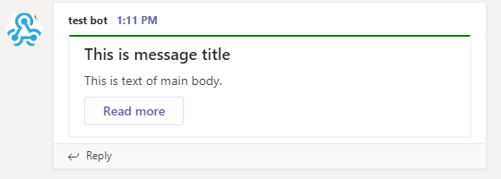
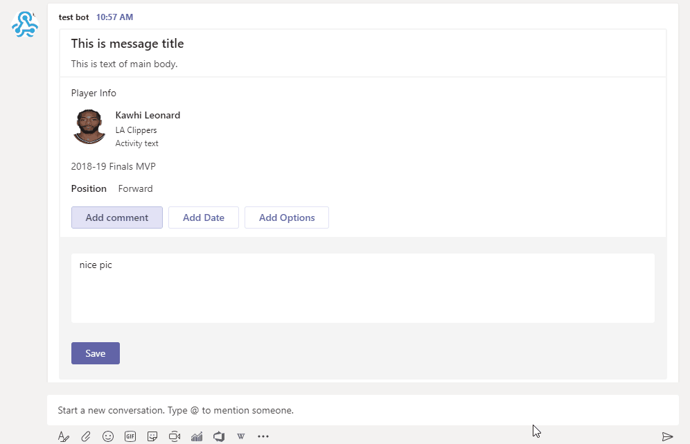

Today I am so pleased to introduce my first CRAN package for sending
formatted messages to Microsoft Teams,
[`teamr`](https://github.com/wwwjk366/teamr).

Motivation is simple here. For years I have been using Slack and built
many slash commands and apps using incoming webhooks with R, but ever
since I started to use Teams, I found that we will have the same needs
for communicating with R as well. So with some inspiration from the
Python package [`pymsteams`](https://pypi.org/project/pymsteams/). I
created `teamr` package with the hope that this package will provide a
simple and clean way to talk to Teams from R.

Installation
------------

You can install the released version of teamr from
[CRAN](https://CRAN.R-project.org) with:

```r
install.packages("teamr")
```

And the development version from [GitHub](https://github.com/) with:

```r
# install.packages("devtools")
devtools::install_github("wwwjk366/teamr")
```

Example
-------

This is a basic example of send a simple titled message to MS Teams:

``` r
library(teamr)

# initiate new connector card object
cc <- connector_card$new(hookurl = "https://outlook.office.com/webhook/...")
# add text
cc$text("This is text of main body.")
# add title
cc$title("This is message title")
# add hyperlink button
cc$add_link_button("Read more", "https://www.google.com")
# change theme color
cc$color("#008000")
```

We can print out the payload that will be sending to given webhook using
`print` method

``` r
# print out the payload for checking
cc$print()
```

    Card: 
      hookurl: https://outlook.office.com/webhook/...
      payload:  {"text":"This is text of main body.","title":"This is message title","potentialAction":[{"@context":"http://schema.org","@type":"ViewAction","name":"Read more","target":["https://www.google.com"]}],"themeColor":"#008000"}

Our `JSON` payload looks good, time to send it out :)

``` r
# send to Teams
cc$send()
```

    [1] TRUE

`send` menthod will return `TRUE` if send was successful (status code
200). If it failed, it will return the reponse object for further
investigation. Our message with a link button will looks like this:



You probablity noticed now that this package is built using `R6`
class(very nice tutorial by Hadley
[here](https://adv-r.hadley.nz/r6.html)). I decide to do this way
because by using OOP concept, it will give use a feeling that you are
“building” your message by adding something piece by piece. At the same
time the code will be highly readable and easy to understand. `teamr`
has 3 main classes as of today — `connector_card`, `card_section` and
`action_card`. For example, let’s add a section to our message:

Message with sections
---------------------

``` r
#initiate new card section object
sec <- card_section$new()

sec$text(sec_text = "2018-19 Finals MVP")
sec$add_fact(fname = "Position", fvalue = "Forward")
sec$title(sec_title = "Player Info")
sec$activity_image(sec_activitiy_image = "https://d2cwpp38twqe55.cloudfront.net/req/201905091/images/players/leonaka01.jpg")
sec$activity_title(sec_activity_title = "Kawhi Leonard")
sec$activity_sub_title(sec_activitiy_subtitle = "LA Clippers")
sec$activity_text(sec_activitiy_text = "Activity text")
cc$add_section(new_section = sec)
cc$send()
```

    [1] TRUE

This is what you will get on you Teams channel:


Message with action cards
-------------------------

Teams also support sending actionable messages. You can add a button to
your message which can send HTTP reqeust to a certain URL with different
type of inputs.

In the following example, I will add a multilined text input, a date
selector and a multiple choice input to our message. Simply changing
`target = "http://..."` in `add_actions` method to the URL you want the
reponse payload to be sent to:

``` r
# create new action card
pa <- action_card$new(type = "ActionCard", name = "Add comment")
# add default actions to card
pa$add_actions(type = "HttpPOST", name = "Save", target = "http://...")
# add text inputs
pa$add_text_inputs(id = "comment", title = "Add comment for this task", is_multi_line = TRUE)
# save to the card object
cc$add_potential_action(pa)

pa2 <- action_card$new(type = "ActionCard", name = "Add Date")
pa2$add_actions(type = "HttpPOST", name = "Save", target = "http://...")
pa2$add_date_inputs(id = "date", title = "Add Date for this task")
cc$add_potential_action(pa2)

pa3 <- action_card$new(type = "ActionCard", name = "Add Options")
pa3$add_actions(type = "HttpPOST", name = "Save", target = "http://...")
# add multiple choices. note that choices must be a nested named list
pa3$add_mchoice_inputs(id = "mchoice", 
                       title = "Choice one", 
                       is_multi_select = TRUE, 
                       choices = list(
                         list(display="In Progress", value=1),
                         list(display="Active", value=2),
                         list(display="Close", value=3))
                       )
cc$add_potential_action(pa3)

cc$send()
```

    [1] TRUE



If you want to learn more regarding Microsoft Connectors, you check out
the offical doc
[here](https://docs.microsoft.com/en-us/microsoftteams/platform/concepts/connectors/connectors-using).

Summary
-------

This is my very first package on CRAN so if you found any bugs please
report here <https://github.com/wwwjk366/teamr/issues>. I do have plan
to add more functionality to the package so stay tuned!
