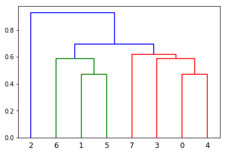

Today I am so pleased to introduce my first PyPI package (so much easier to submit comparing to CRAN) --- [`gower`](https://pypi.org/project/gower/) for calculating gower distance. I used the code from https://github.com/scikit-learn/scikit-learn/issues/5884 and hopefully it can be added to `sklearn` soon.(The core algo is originally wrote by [Marcelo Beckmann](https://github.com/marcelobeckmann) ). There are lots of packages in R that incorporated this method but unfortunately not for Python users. I took this chance to try the whole package-making experience for PyPI and here we go!


## What is gower distance?

Like normal Euclidean distance or cosine distance, Gower distance is a distance measure. However, it can be used to calculate distance between two entity whose attribute has a mixed of categorical and numerical values. Why this is important? Many common clustering algorithms, e.g. K-means clustering - only works when all variables are numeric. [Gower (1971) A general coefficient of similarity and some of its properties. Biometrics 27 857–874.](https://www.jstor.org/stable/2528823?seq=1) 

I won't talk about the math behind it here but if you are interested there are tons of good material out there besides of Gower's original paper:

* https://rstudio-pubs-static.s3.amazonaws.com/423873_adfdb38bce8d47579f6dc916dd67ae75.html#fnref2
* https://towardsdatascience.com/clustering-on-mixed-type-data-8bbd0a2569c3
* https://www.math.vu.nl/~sbhulai/papers/thesis-vandenhoven.pdf

## Installation

You can install directly from PyPI using `pip`:

`pip install gower`


## Calculate Gower Distance


```python
import numpy as np
import pandas as pd

Xd=pd.DataFrame({'age':[21,21,19, 30,21,21,19,30],
'gender':['M','M','M','M','F','F','F','F'],
'civil_status':['MARRIED','SINGLE','SINGLE','SINGLE','MARRIED','SINGLE','WIDOW','DIVORCED'],
'salary':[3000.0,1200.0 ,32000.0,1800.0 ,2900.0 ,1100.0 ,10000.0,1500.0],
'has_children':[1,0,1,1,1,0,0,1],
'available_credit':[2200,100,22000,1100,2000,100,6000,2200]})
Yd = Xd.iloc[0:1,:]
```

First create some fake data called `Xd` and `Yd` as pandas dataframe:


```python
Xd
```


<div>
<style scoped>
    .dataframe tbody tr th:only-of-type {
        vertical-align: middle;
    }

    .dataframe tbody tr th {
        vertical-align: top;
    }

    .dataframe thead th {
        text-align: right;
    }
</style>
<table border="1" class="dataframe">
  <thead>
    <tr style="text-align: right;">
      <th></th>
      <th>age</th>
      <th>gender</th>
      <th>civil_status</th>
      <th>salary</th>
      <th>has_children</th>
      <th>available_credit</th>
    </tr>
  </thead>
  <tbody>
    <tr>
      <th>0</th>
      <td>21</td>
      <td>M</td>
      <td>MARRIED</td>
      <td>3000.0</td>
      <td>1</td>
      <td>2200</td>
    </tr>
    <tr>
      <th>1</th>
      <td>21</td>
      <td>M</td>
      <td>SINGLE</td>
      <td>1200.0</td>
      <td>0</td>
      <td>100</td>
    </tr>
    <tr>
      <th>2</th>
      <td>19</td>
      <td>M</td>
      <td>SINGLE</td>
      <td>32000.0</td>
      <td>1</td>
      <td>22000</td>
    </tr>
    <tr>
      <th>3</th>
      <td>30</td>
      <td>M</td>
      <td>SINGLE</td>
      <td>1800.0</td>
      <td>1</td>
      <td>1100</td>
    </tr>
    <tr>
      <th>4</th>
      <td>21</td>
      <td>F</td>
      <td>MARRIED</td>
      <td>2900.0</td>
      <td>1</td>
      <td>2000</td>
    </tr>
    <tr>
      <th>5</th>
      <td>21</td>
      <td>F</td>
      <td>SINGLE</td>
      <td>1100.0</td>
      <td>0</td>
      <td>100</td>
    </tr>
    <tr>
      <th>6</th>
      <td>19</td>
      <td>F</td>
      <td>WIDOW</td>
      <td>10000.0</td>
      <td>0</td>
      <td>6000</td>
    </tr>
    <tr>
      <th>7</th>
      <td>30</td>
      <td>F</td>
      <td>DIVORCED</td>
      <td>1500.0</td>
      <td>1</td>
      <td>2200</td>
    </tr>
  </tbody>
</table>
</div>


```python
Yd
```


<div>
<style scoped>
    .dataframe tbody tr th:only-of-type {
        vertical-align: middle;
    }

    .dataframe tbody tr th {
        vertical-align: top;
    }

    .dataframe thead th {
        text-align: right;
    }
</style>
<table border="1" class="dataframe">
  <thead>
    <tr style="text-align: right;">
      <th></th>
      <th>age</th>
      <th>gender</th>
      <th>civil_status</th>
      <th>salary</th>
      <th>has_children</th>
      <th>available_credit</th>
    </tr>
  </thead>
  <tbody>
    <tr>
      <th>0</th>
      <td>21</td>
      <td>M</td>
      <td>MARRIED</td>
      <td>3000.0</td>
      <td>1</td>
      <td>2200</td>
    </tr>
  </tbody>
</table>
</div>


### Compute distance matrix

Main function for the package is `gower.gower_matrix()`. This function has 4 arguments:

* `data_x` : input data
* `data_y` : default `None`
* `weight` : weight of each variable, default to be a vector of 1
* `cat_features` : a boolean vector indicates categorical features, default `None` and function will determine by itself

Let's run it on our dataframe `Xd`


```python
import gower

gower.gower_matrix(Xd)
```

    array([[0.        , 0.3590238 , 0.5040732 , 0.31787416, 0.16872811,
            0.52622986, 0.59697855, 0.47778758],
           [0.3590238 , 0.        , 0.52976364, 0.3138769 , 0.523629  ,
            0.16720603, 0.45600235, 0.6539635 ],
           [0.5040732 , 0.52976364, 0.        , 0.48861402, 0.6728013 ,
            0.6969697 , 0.740428  , 0.8151941 ],
           [0.31787416, 0.3138769 , 0.48861402, 0.        , 0.4824794 ,
            0.48108295, 0.74818605, 0.34332284],
           [0.16872811, 0.523629  , 0.6728013 , 0.4824794 , 0.        ,
            0.35750175, 0.43237334, 0.3121036 ],
           [0.52622986, 0.16720603, 0.6969697 , 0.48108295, 0.35750175,
            0.        , 0.2898751 , 0.4878362 ],
           [0.59697855, 0.45600235, 0.740428  , 0.74818605, 0.43237334,
            0.2898751 , 0.        , 0.57476616],
           [0.47778758, 0.6539635 , 0.8151941 , 0.34332284, 0.3121036 ,
            0.4878362 , 0.57476616, 0.        ]], dtype=float32)


Let's try to treat them all as categorical features:


```python
gower.gower_matrix(Xd, cat_features = [True, True,True,True,True,True])
```

    array([[0.        , 0.6666667 , 0.6666667 , 0.6666667 , 0.5       ,
            0.8333333 , 1.        , 0.6666667 ],
           [0.6666667 , 0.        , 0.6666667 , 0.6666667 , 0.8333333 ,
            0.33333334, 0.8333333 , 1.        ],
           [0.6666667 , 0.6666667 , 0.        , 0.5       , 0.8333333 ,
            0.8333333 , 0.8333333 , 0.8333333 ],
           [0.6666667 , 0.6666667 , 0.5       , 0.        , 0.8333333 ,
            0.8333333 , 1.        , 0.6666667 ],
           [0.5       , 0.8333333 , 0.8333333 , 0.8333333 , 0.        ,
            0.6666667 , 0.8333333 , 0.6666667 ],
           [0.8333333 , 0.33333334, 0.8333333 , 0.8333333 , 0.6666667 ,
            0.        , 0.6666667 , 0.8333333 ],
           [1.        , 0.8333333 , 0.8333333 , 1.        , 0.8333333 ,
            0.6666667 , 0.        , 0.8333333 ],
           [0.6666667 , 1.        , 0.8333333 , 0.6666667 , 0.6666667 ,
            0.8333333 , 0.8333333 , 0.        ]], dtype=float32)


It also supports array inputs:


```python
X = np.asarray(Xd)
gower.gower_matrix(X)
```


    array([[0.        , 0.3590238 , 0.5040732 , 0.31787416, 0.16872811,
            0.52622986, 0.59697855, 0.47778758],
           [0.3590238 , 0.        , 0.52976364, 0.3138769 , 0.523629  ,
            0.16720603, 0.45600235, 0.6539635 ],
           [0.5040732 , 0.52976364, 0.        , 0.48861402, 0.6728013 ,
            0.6969697 , 0.740428  , 0.8151941 ],
           [0.31787416, 0.3138769 , 0.48861402, 0.        , 0.4824794 ,
            0.48108295, 0.74818605, 0.34332284],
           [0.16872811, 0.523629  , 0.6728013 , 0.4824794 , 0.        ,
            0.35750175, 0.43237334, 0.3121036 ],
           [0.52622986, 0.16720603, 0.6969697 , 0.48108295, 0.35750175,
            0.        , 0.2898751 , 0.4878362 ],
           [0.59697855, 0.45600235, 0.740428  , 0.74818605, 0.43237334,
            0.2898751 , 0.        , 0.57476616],
           [0.47778758, 0.6539635 , 0.8151941 , 0.34332284, 0.3121036 ,
            0.4878362 , 0.57476616, 0.        ]], dtype=float32)


### Find top n similar items

One intuition for me to create this package is to use it at work. I usually need to find look-alike customer for my company. E.g. one customer with certain KPI and properties --- location, tenure, RFM metrics etc and they are often mixed type. Gower distance can easily be calculated the distance between them and allows me to give certain variables higher/lower weight.


```python
gower.gower_topn(Xd.iloc[0:1,:], Xd, n = 5)
```


    {'index': array([0, 4, 3, 1, 7]),
     'values': array([0.        , 0.16872811, 0.31787416, 0.3590238 , 0.47778758],
           dtype=float32)}


The function will return two arrays. The index of the top 5 closest records and their distance in decimals

## Application in Hierarchical Clustering

The most popular use cases for mathematical distances are clustering. `cluster` module in `scipy` provided the ability to use custom distance matrix to do hierarchical clustering. Let's run a simple clustering model on our toy data. First we need to create the linkage using our precomputed distance matrix:


```python
import numpy as np
import matplotlib.pyplot as plt
from scipy.cluster.hierarchy import linkage, fcluster, dendrogram

dm = gower.gower_matrix(X)
Zd = linkage(dm) 
```

    /opt/conda/lib/python3.7/site-packages/ipykernel_launcher.py:6: ClusterWarning: scipy.cluster: The symmetric non-negative hollow observation matrix looks suspiciously like an uncondensed distance matrix
      


Say we want total of 3 clusters:


```python
cld = fcluster(Zd, 3, criterion='maxclust')
cld
```


    array([2, 1, 3, 2, 2, 1, 1, 2], dtype=int32)


We can also inspect the dendrogram created from our distance matrix: 


```python
dendrogram(Zd) 
```



This package will be maintained so please feel free to report bug and issues here: (https://github.com/wwwjk366/gower/issues).

Last but not least:


