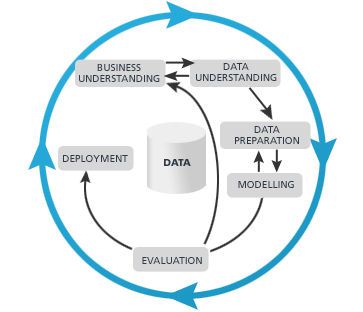

I consider myself as an extremely lucky guy. When I picked Statistics as my college major, I didn’t know I would be working as a data scientist after I graduate. The job “Data Scientist” probably didn't even exist back then. And here I am, after almost 9 years, I matured from someone that struggled to run and diagnose a linear regression to a fairly experienced data scientist that gives talks and lectures. When I speak of Data Science and the career development of data scientists, one of the questions that I have been asked a lot is --- **What are the most important skills/traits to become a successful data scientist?** Many people think the answer is the coding skills. The ability of writing a state of art python script that can run the most advanced algorithm. Well, coding skill is important but in my honest opinion it's far from the most important one. To me, coding skill is like the knife skill to a chef. Yes a better knife skill can make a chef’s work easier. However, cutting a potato wedge half inch thinner or thicker won’t affect the taste of the dish that much. So what are the most important traits of a successful data scientist?

## Curiosity

*"Eager to know hows and whys"*

More specifically, **Intellectual curiosity**. Not “Curiosity killed the cat” that kind of curiosity. Why is it important? Because a big part of data science is able finding insights and reason behind the data. Or maybe that's why it’s called a “science” because scientists are curious. Newton discovered gravity because he was curious about apples falling from the tree. So when good data scientists saw the data showing customers are churning, they would try to figure out why.

## A Data Science Problem solving framework

*"Think as a consultant"*

This is a big concept. Good data scientists have a **framework** which they can leverage to approach problems at work. That means, when given an ambiguous request, we should know how to decompose it and break down into solvable pieces. One of the most common pitfalls is to start working on a problem without a clear goal and roadmap in mind. Because my wife was studying for an MBA degree at Chicago Booth. I am lucky to know from some consultant from the big 3 consulting companies her classmate and I learned a lot from them about how to approach problems at work. 

Let’s assume you received a task to build a model that generates leads for sales people, a propensity model. What is the first thing you should do? Many might start researching and testing out algorithms already. However the first question you should ask is --- **What constitutes success?** Can we quantify the goal? Are we looking to increase the sales by 10%, 15%? Is that doable? How do we measure it? After clarifying those questions with your stakeholders, next steps became clear. Here is a process I always follow when designing and working on a data science project.

  see [^1]

[^1]: Data Science for Business: What You Need to Know about Data Mining and Data-Analytic Thinking by Foster Provost

After understanding the business goals and expectations, we can go about figuring out the data quality and availability. The following work will be a standard data science workflow. 

I personally find this skill is very very important when interviewing for jobs or hiring as a manager. That fact is because many organizations are still in the phase of adopting data science and data science teams often face a lot of ambiguous requests and projects. Without a solid framework it is hard to be successful and slowly the team will function as a support team instead of driving the direction of the business.

## Business Intuition

*“Knows How and What to do”*

Believe it or not, different people in a company have very different motivations and goals. If you were an executive, your focus might be to increase the top line, attract more funding, play PR right, etc. While as a data scientist, that is often not what you had in mind. I saw many data scientist teams struggling to win support from high up and fail to turn the organization to be data-driven. Let’s say you were given a task to build a dynamic pricing model for your company. Common mistake is that the team would try the most complicated and sophisticated modeling technique that requires a lot of experiments and resources. The model might increase the revenue by 20% however a simple linear regression will do about 10%. In the end the team was taking too long to come up with a solution and eventually the project got called off because executives lost patience.  Why not **start small** and grab the low hanging fruit? Think of ROI, do not afraid of fail fast and take solid baby steps.

## Communication

*"Explain Like I'm 5"*

Why communication is important for data scientists? Because oftentimes you need to communicate/socialize your work with executives/non-technical people.  How would you go about explaining your recent build neural networks models to them? People tend to question and fear the things that they do not understand. If you can’t explain the concept to them it is very hard to prove the value your team is generating. I have been teaching Machine Learning and Data Science for a while and I have been appreciating more and more the skills of **explaining complex concepts to people from various backgrounds**. Here is a Youtube channel I came across called “5 Levels” where they try to explain complex ideas  first to a child, then a teenager, then an undergrad majoring in the same subject, a grad student and, finally, a colleague.[https://www.wired.com/video/series/5-levels] Another example is [3Blue1Brown, by Grant Sanderson](https://www.youtube.com/channel/UCYO_jab_esuFRV4b17AJtAw).

Not all people are the same and if we are able to convey a complicated to any audience, that knowledge will stick and pass on for generations.

## Summary

In summary, those are the 4 commonly overlooked traits to many data scientists. I personally was not aware of them as well when I started my career. For all the mistakes and failures I encountered I learn them the hard way. Therefore I just want to share those thoughts to you and hope it will help you in your journey of data science careers.
